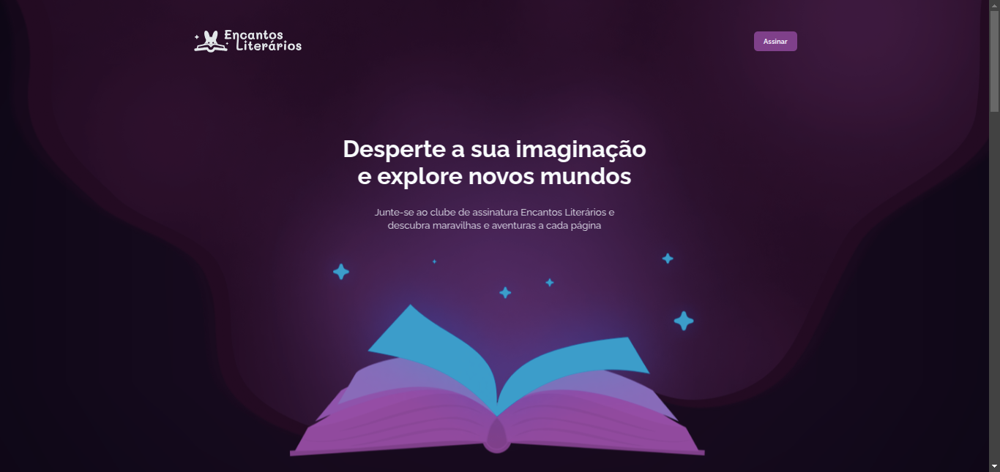

<h1 align="center">✨ Encantos Literários 📖</h1>

> Formação Full-Stack: Avançando no HTML e CSS: Animações e Transições (desafio prático).

O projeto é uma landing page com animações e transições, criada para divulgar um clube de assinatura de livros.

[🔗 Clique aqui para acessar](https://fel1324.github.io/EncantosLiterarios/)

## 🤖 Tecnologias

- HTML
- CSS
- Git e Github

## 💚 Contato

rafael.roberto200618@gmail.com

---

Feito com ♥ by Rocketseat :wave: [Participe da nossa comunidade!](https://discord.gg/rocketseat)